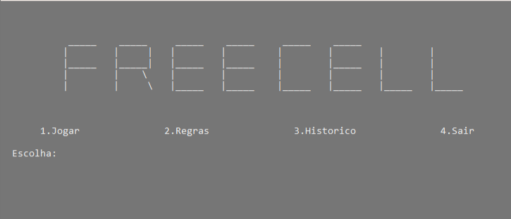
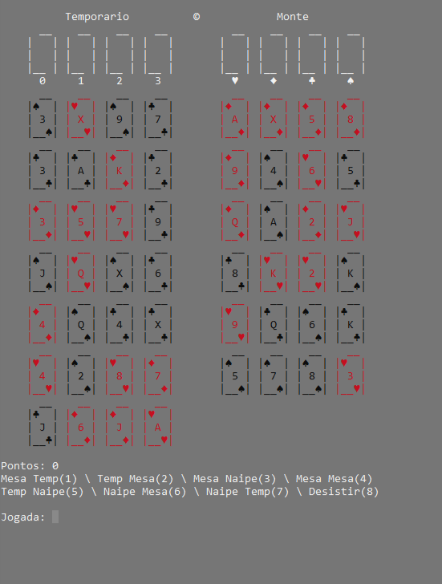
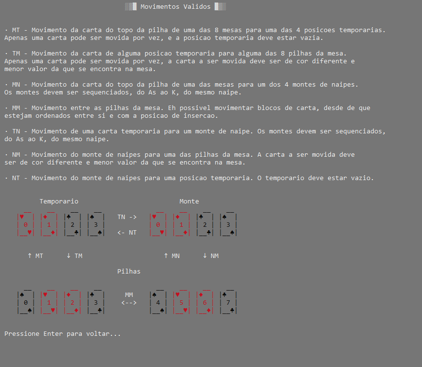

# AEDS-FreeCell
Jogo FreeCell desenvolvido em C.




Uma implementação do popular jogo de cartas, Free Cell, desenvolvida em C como parte do projeto da disciplina de Estrutura de Dados na Universidade Federal de Itajubá. Este projeto tem como objetivo principal a aplicação prática de estruturas dinâmicas, proporcionando uma oportunidade de aprender e praticar os conceitos de alocação dinâmica de memória, listas encadeadas e manipulação de dados.

# Sobre o Jogo

O Free Cell é um jogo de cartas solitário que requer habilidade, estratégia e paciência para ser vencido. A versão implementada neste projeto é jogada diretamente no terminal/console, e todas as interações ocorrem por meio de comandos de texto.

# Uso
- Menu Principal: Ao iniciar o jogo, você é recebido por um menu com as seguintes opções:
1. Jogar: Inicia uma nova partida do jogo Free Cell.
2. Regras: Exibe as regras do jogo Free Cell.
3. Histórico: Mostra um histórico das partidas anteriores.
4. Sair: Encerra o jogo.

- Jogabilidade: Durante o jogo, você pode movimentar cartas entre as áreas do jogo, incluindo Mesa, Temporário e Monte de Naipe. Assim como, desistir da partida atual.

# Compilação e Execução
Para compilar e executar o jogo, siga estas etapas:

1. Abra um terminal e navegue até o diretório do projeto.
  ```c++
  cd AEDS-FreeCell/src
  ```
2. Compile o código-fonte usando um compilador C (por exemplo, GCC) com o seguinte comando:
  ```c++
  gcc main.c freecell.c resources.c -o main  
  ```
3. Execute o arquivo executável gerado:
  ```c++
  .\main.exe
  ```

## Screenshots





## License

This project is under the license [MIT](./LICENSE).


